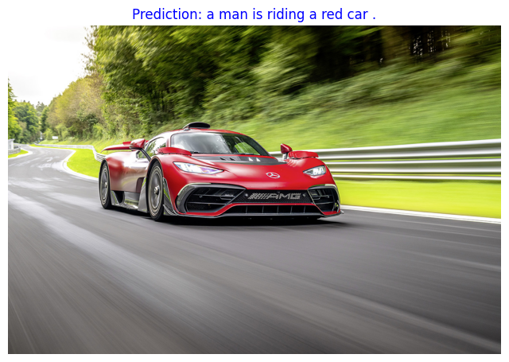
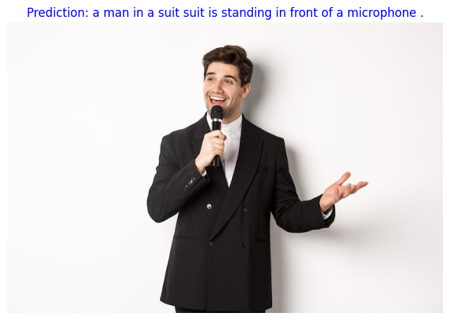

# Image Captioning avec Attention (ResNet + LSTM) 🖼️

## 1. Introduction
Ce projet implémente un système de **légendage automatique d'images** (Image Captioning). L'objectif est de traduire le contenu visuel d'une image en une description textuelle naturelle.

Pour cela, nous avons conçu une architecture encodeur-décodeur hybride intégrant un **mécanisme d'attention (Attention Mechanism)**, permettant au modèle de se concentrer sur des zones spécifiques de l'image lors de la génération de chaque mot.

## 2. Dataset : Flickr30k
Le dataset contient 30 000 images, chacune associée à plusieurs descriptions.
* **Traitement Image** : Redimensionnement (224x224), normalisation et transformation en tenseurs.
* **Traitement Texte** : Tokenisation, création de vocabulaire, et utilisation d'embeddings pré-entraînés.

## 3. Architecture Technique

### Encodeur : ResNet50 (Transfer Learning)
Nous utilisons un **ResNet50 pré-entraîné** dont nous avons retiré les dernières couches fully connected.
* Contrairement aux approches classiques qui utilisent un vecteur global, nous extrayons les **features map spatiales** de la dernière couche de convolution.
* Les poids du ResNet sont gelés (frozen) pour conserver les caractéristiques visuelles apprises sur ImageNet.

### Mécanisme d'Attention (Custom Implementation)
Nous avons implémenté manuellement un module d'attention (type Bahdanau/Soft Attention).
* Il calcule des **scores d'attention** entre l'état caché actuel du LSTM et les différentes zones de l'image (features du CNN).
* Cela produit un **vecteur de contexte** dynamique qui change à chaque pas de temps de la génération du texte.

### Décodeur : LSTM avec Attention
Un LSTM personnalisé qui prend en entrée :
1.  Le mot précédent (via Embedding).
2.  L'état caché précédent.
3.  Le vecteur de contexte (issu de l'attention).

## 4. Stratégie d'Entraînement
* **Loss** : CrossEntropyLoss.
* **Scheduler** : Utilisation de `StepLR` pour réduire le learning rate progressivement et affiner la convergence.
* **Embeddings** : Initialisation avec les poids de Word2Vec pour accélérer l'apprentissage sémantique.

## 5. Résultats et Exemples
Le modèle est capable d'aligner les mots générés avec les zones visuelles pertinentes.

**Exemple 1 :**

**Exemple 2 :**

## 6. Conclusion
L'ajout du mécanisme d'attention améliore significativement la pertinence des légendes par rapport à une approche simple CNN-RNN. Ce TP a permis de maîtriser l'implémentation de couches personnalisées dans PyTorch et la gestion complexe des dimensions de tenseurs dans les modèles multimodaux.